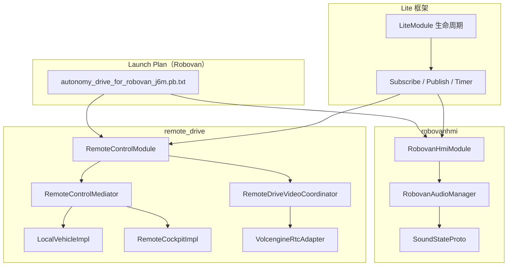
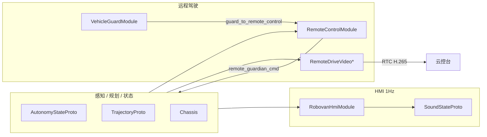

# 实习生学习路线：Lite + RobovanHMI + RemoteDrive

> **适用对象**：实习生 / 校招新人，希望同时建立 onboard 基础、做出可演示产出，并积累可写进简历（含机器人行业）的项目经验。  
> **主线车型**：Robovan（无人小巴），Launch Plan 以 `autonomy_drive_for_robovan_j6m.pb.txt` 为代表。  
> **与平台交付路线关系**：通用平台地图见 [`项目学习.md`](./项目学习.md)；本文是其中的 **§2.5 实习生专题** 固定版。

---

## 目录

1. [为什么选这条线](#1-为什么选这条线)
2. [模块关系总览](#2-模块关系总览)
3. [四周阅读清单](#3-四周阅读清单)
4. [RemoteDrive 专题学习计划](#4-remotedrive-专题学习计划)（第 3–4 周展开）
5. [RobovanAudioManager 逐函数阅读卡](#5-robovanaudiomanager-逐函数阅读卡)
6. [根据代码逆向生成项目文档](#6-根据代码逆向生成项目文档)
7. [生成简历条目](#7-生成简历条目)
8. [教学 Demo：`study_intern/`](#8-教学-demostudy_intern)
9. [构建与单测命令](#9-构建与单测命令)
10. [阶段检查清单](#10-阶段检查清单)

---

## 1. 为什么选这条线

| 模块 | 代码体量（约） | 上手难度 | 机器人行业可迁移性 | 简历可讲性 |
|------|----------------|----------|-------------------|------------|
| `lite/` | 大（框架） | 中 | ⭐⭐⭐⭐⭐（类 ROS2） | 需结合业务模块 |
| `robovanhmi/` | ~1600 行 | 低 | ⭐⭐⭐⭐（服务机器人 HMI） | ⭐⭐⭐⭐⭐ |
| `remote_drive/` | ~9000 行 | 中高 | ⭐⭐⭐⭐⭐（遥操作） | ⭐⭐⭐⭐⭐ |

**推荐顺序**：`lite` 打底 → `robovanhmi` 做出第一个完整需求 → 按兴趣深入 `remote_drive`（遥操作）。

---

## 2. 模块关系总览



**Robovan 上典型同时启用的 Lite 模块**（在 launch plan 中搜索下列配置）：

| 模块配置 | 路径 |
|----------|------|
| HMI 播报 | `lite/launch_config/module_configs/robovan_hmi_module.pb.txt` |
| 遥操作控制 | `lite/launch_config/module_configs/remote_control_module.pb.txt` |
| 遥操作视频 | `remote_drive_video_module_primary.pb.txt`（及 secondary） |

**端到端数据流（口述用）**：

```text
相机 encoded_image → remote_drive_video → RTC → 云控台
云控台指令 → RemoteControlModule → remote_guardian_cmd / control_command → 底盘
autonomy_state / chassis / trajectory / … → RobovanHmiModule → sound_state → 车内播报
```

---

## 3. 四周阅读清单

### 第 1 周：Lite 打底

**目标**：能回答「模块如何被拉起、如何订阅/发布、定时器怎么用」。

| Day | 阅读文件 | 关注点 |
|-----|----------|--------|
| 1 | `onboard/CLAUDE.md` §1–3、`.bazelrc`（搜 robovan/j6） | 平台宏与编译 config |
| 1 | [`项目学习.md`](./项目学习.md) §1–2 | 启动顺序、Lite 位置 |
| 2 | `lite/CLAUDE.md` | LiteModule、pub/sub、定时器、SHM 概念 |
| 2 | `lite/proto/module_config.proto` | inputs/outputs/field_name/channel |
| 3 | `lite/lite_module.h`（节选） | `OnInit` / `OnSubscribeChannels` / `OnSetUpTimers`、`Subscribe`、`Publish`、`AddTimerOrDie` |
| 3 | `lite/lite_client_base.h` | skim 接口 |
| 4 | `lite/launch_plan/CLAUDE.md` | 三层 merge、Node、ExecutionManager |
| 4 | `lite/launch_plan/plans/autonomy_drive_for_robovan_j6m.pb.txt` | 搜 `robovan_hmi`、`remote_control`、`remote_drive_video` |
| 4 | `robovan_hmi_module.pb.txt`、`remote_control_module.pb.txt` | 模块 IO 列表 |
| 5 | `lite/launch_autonomy_main.cc`（节选） | 如何加载 LaunchPlan |

**对照范例**（最短 mental model）：

```cpp
// onboard/robovanhmi/robovan_hmi_module.cc
void RobovanHmiModule::OnSubscribeChannels() {
  Subscribe(&RobovanHmiModule::HandleTrajectory, this, 20);
  // ...
}
void RobovanHmiModule::OnSetUpTimers() {
  AddTimerOrDie("publish_sound_state", [this]() { PublishSoundState(); },
                absl::Seconds(1), absl::Seconds(1), false);
}
```

**自检**：
- [ ] `module_class_name` 与 `REGISTER_LITE_MODULE` 必须一致
- [ ] `OnInit` 里一般不直接 `Publish`
- [ ] `module_config.pb.txt` 的 `inputs` 与代码 `Subscribe` 可互查

---

### 第 2 周：robovanhmi

**目标**：讲清「多路输入 → 播报状态机 → 1Hz 输出」，能改一条规则并补单测。

| Day | 阅读文件 | 关注点 |
|-----|----------|--------|
| 1 | `robovanhmi/CLAUDE.md`、`robovan_hmi_module.h/cc` | 薄 Module，逻辑在 AudioManager |
| 1 | `proto/sound.proto` | `SoundId`、`SoundStateProto` |
| 2 | `audio/robovan_audio_manager.h` | 状态缓存、`sound_state_map_` |
| 2 | `audio/robovan_audio_manager.cc` | `Update*` → `Process*` 调用链 |
| 3–5 | 同上 `Process*` 函数 | 见 [§5 阅读卡](#5-robovanaudiomanager-逐函数阅读卡) |
| 6 | `audio/robovan_audio_manager_test.cc` | 单测驱动理解 |
| 7 | 自绘「输入 proto → Process → SoundId」表 | 周复盘 |

**关键设计**（`PublishSoundState`）：

- 1 Hz 聚合 `BuildSoundState()` 后 `Publish`
- 随即 `ClearSoundState()`：one-shot 不重复；continuous 需下游/新消息再次触发

---

### 第 3–4 周：remote_drive + vehicle_guard（详细计划见 §4）

**目标**：能讲清「云控台 ↔ 车端」控制与图传两条链路，及其与 HMI / 安全看门狗的关系。

| 周 | 主题 | 详细日程 |
|----|------|----------|
| 第 3 周 | 控制链路（Mediator、车/舱组件、Robovan 适配、限速） | [§4.2 第 3 周](#42-第-3-周控制链路) |
| 第 4 周 | 视频链路 + vehicle_guard + 三链路串联 | [§4.3 第 4 周](#43-第-4-周视频与安全) |

**架构（必记）**：

```text
RemoteControlModule（LiteModule + RemoteControlMediator）
  ├── vehicle_component_   （LocalVehicleImpl）
  ├── cockpit_component_   （RemoteCockpitImpl）
  └── mini_program_component_（可选）
         ↑
CommunicationManager / MessageDispatcher

RemoteDriveVideoModulePrimary/Secondary  ← 订阅相机，推 RTC（与控制解耦）

VehicleGuardModule  ← 远程模式告警 + GuardToRemoteControl（50Hz）
```

---

**时间不够时的最小路径**：

| 可用时间 | 建议 |
|----------|------|
| 1 周 | 第 1 周 Day 1–4 + 第 2 周全部 |
| 2 周 | 第 1–2 周 + 第 3 周 Day 1–4 |
| 4 周 | 按上表完整执行 |

---

## 4. RemoteDrive 专题学习计划

> **前置**：完成第 1 周 Lite + 第 2 周 robovanhmi（至少能讲清 `SoundStateProto` 1Hz 快照）。  
> **源码根目录**：`onboard/remote_drive/`；Robovan 车型说明见 [`remote_drive/CLAUDE.md`](./remote_drive/CLAUDE.md)。  
> **安全配套**：`onboard/vehicle_guard/`（远程模式看门狗，与 remote_drive 强相关）。

### 4.1 学完应达到的能力

| 能力 | 验收方式 |
|------|----------|
| 画出 **控制 / 视频 / HMI** 三条 Lite 链路 | 白板或 mermaid，标出主要 proto |
| 讲清 **Mediator + 双 Component** | 能说明 `OnSendMessageToCockpit` / `OnSendMessageToVehicle` 方向 |
| 对照 **module_config IO** 与代码 | 至少 5 个 input 能指到 `Handle*` 或 Component |
| 理解 **Robovan minibus 适配** | `MinibusDataConverter` 与 `remote_control_config.pb.txt` 中 `vehicle_model: "minibus"` |
| 区分 **vehicle_guard 两路输出** | 1Hz `HmiToRemoteProto` vs 50Hz `GuardToRemoteControlProto` |
| 跑通节选单测 | 见 [§9](#9-构建与单测命令) |

### 4.2 第 3 周：控制链路

**周目标**：云控台 ↔ 车端双向控制、RTC 会话、限速与协议适配。

| Day | 阅读文件 | 关注点 | 产出 |
|-----|----------|--------|------|
| 1 | [`remote_drive/CLAUDE.md`](./remote_drive/CLAUDE.md) | 子目录、Mediator、视频解耦 | 子目录清单笔记 |
| 1 | `remote_drive_control/interface/remote_control_mediator.h` | Mediator API 全集 | 双向箭头图 |
| 1 | `remote_drive_control/remote_control_module.h` | 继承 `LiteModule` + `RemoteControlMediator` | 列出 override 方法 |
| 2 | `remote_drive_control/remote_control_module.cc` | `OnInit`、`OnSubscribeChannels`、`LoadConfig` | 生命周期时序 |
| 2 | `lite/launch_config/module_configs/remote_control_module.pb.txt` | inputs/outputs（Robovan 全量 IO） | IO 表草稿（≥10 行） |
| 2 | `remote_drive_control/config/remote_control_config.pb.txt` | `vehicle_model: "minibus"`、限速参数 | 配置项对照表 |
| 3 | `core_impl/local_vehicle_impl.*` | 车端订阅、上行状态打包 | 「车 → 云」消息列表 |
| 3 | `core_impl/remote_cockpit_impl.*` | 座舱下行指令、RTC 注册 | 「云 → 车」消息列表 |
| 4 | `data_adapter/data_adapter.cc`、`minibus_data_converter.*` | Robovan 转向/油门等字段换算 | minibus 与通用 converter 差异 |
| 4 | `util/communication_manager.*`、`message_dispatcher.*` | 路由、超时、`RegisterCockpitHandler` | 超时断连会怎样 |
| 5 | `util/speed_limit_controller.*` + `speed_limit_controller_test.cc` | `SetSpeedLimit` / `ApplySpeedLimit` | 能口述限速写入 `guardian_cmd` 路径 |
| 5 | `volcengine_rtc/README.md`、`rtc_adapter/volcengine/*`（浏览） | RTC 连接、Token、推流边界 | 与控制通路解耦一句话 |

**控制链路架构（必记）**：

```text
                    RemoteControlModule
                    (LiteModule + Mediator)
                           │
         ┌─────────────────┼─────────────────┐
         ▼                 ▼                 ▼
  LocalVehicleImpl   RemoteCockpitImpl   MiniProgram（可选）
         │                 │
         │    CommunicationManager / MessageDispatcher
         │                 │
         └─────── RTC（Volcengine）───────┘
                           │
                    cockpit / 小程序
```

**与 robovanhmi 的边界**（第 3 周末应能答）：

| 链路 | 模块 | 典型输出 | 消费者 |
|------|------|----------|--------|
| HMI 播报 | `RobovanHmiModule` | `SoundStateProto`（1Hz） | Tbox / 音响 |
| 远程控制 | `RemoteControlModule` | `remote_guardian_cmd_proto` 等 | 规划 / 控制栈 |
| 远程告警 | `VehicleGuardModule` | `HmiToRemoteProto`、`guard_to_remote_control_proto` | 云控 UI / RemoteControl |

三者 **互不替代**：HMI 不管控车；RemoteControl 不管到站语音；VehicleGuard 在 `L4_STATE_REMOTE_NORMAL` 才强化横向碰撞等逻辑。

### 4.3 第 4 周：视频与安全

**周目标**：多路视频 FSM、带宽自适应；与 vehicle_guard 串联；Robovan launch 三链路一体复盘。

| Day | 阅读文件 | 关注点 | 产出 |
|-----|----------|--------|------|
| 1 | `remote_drive_video/README.md`、`DOC_remote_drive_video.md` | Primary/Secondary/Tertiary 分工 | 三路流对比表 |
| 1 | `remote_drive_video_coordinator.*`、`remote_drive_video_fsm.*` | Init → Streaming → Error | FSM 状态转移草图 |
| 2 | `remote_drive_video_bandwidthestimator.*` | 码率 / 切流策略 | 网络变差时行为一句话 |
| 2 | [`vehicle_guard/CLAUDE.md`](./vehicle_guard/CLAUDE.md) | 双循环、远程模式激活条件 | 1Hz vs 50Hz 输出表 |
| 3 | `vehicle_guard_module.cc`（浏览 MainLoop / ToRemoteControl） | 与 `guard_to_remote_control_proto` 订阅关系 | 画 RemoteControl ← VehicleGuard 箭头 |
| 3 | 再读 `remote_control_module.pb.txt` 中 `guard_to_remote_control_proto`、`guardian_cmd_proto` | 安全约束如何进入控车 | 更新 IO 表 |
| 4 | `lite/launch_plan/plans/autonomy_drive_for_robovan_j6m.pb.txt` | 哪些 Node 启 RemoteControl / Video / Hmi | Launch 拓扑简图 |
| 5 | 跑单测 + 全文复盘 | 见 §9；对照 [§6.5](#65-以-remote_drive-为例的逆向产出清单) | remote_drive 迷你架构文档 |

**三链路串联（Robovan 复盘用）**：



### 4.4 Robovan 关键配置速查

| 项 | 路径 | 说明 |
|----|------|------|
| 控制 Module 配置 | `lite/launch_config/module_configs/remote_control_module.pb.txt` | 20+ 路 input，含 `hmi_to_remote_proto`、`guard_to_remote_control_proto` |
| 车型适配 | `remote_drive_control/config/remote_control_config.pb.txt` | `vehicle_model: "minibus"` → `MinibusDataConverter` |
| Launch Plan | `lite/launch_plan/plans/autonomy_drive_for_robovan_j6m.pb.txt` | 查 `REMOTE_CONTROL_MODULE`、视频模块、HMI 是否同 plan |
| 模块说明 | `remote_drive/CLAUDE.md` | 陷阱：RTC 失败需 cockpit 重连；视频崩溃不影响控制 |

### 4.5 单测与实验（第 3–4 周穿插）

```bash
# 在仓库根目录；config 以团队 Robovan 配置为准
bazel test //onboard/remote_drive/remote_drive_control/util:speed_limit_controller_test --test_output=errors
bazel test //onboard/remote_drive/remote_drive_control/util:message_dispatcher_test --test_output=errors
bazel test //onboard/remote_drive/remote_drive_control/data_adapter:data_adapter_test --test_output=errors
bazel test //onboard/remote_drive/remote_drive_video:remote_drive_video_fsm_test --test_output=errors
```

阅读单测时建议：**先看 `TEST_F` 名 → 再跳被测函数**，把测试名写进自己的规则/行为表（与 robovanhmi 第 2 周方法一致）。

### 4.6 第 3–4 周阶段检查（remote_drive 专用）

- [ ] 能不看代码画出 Mediator + `LocalVehicleImpl` / `RemoteCockpitImpl`
- [ ] 能解释 `minibus` 在 `DataAdapter` 中的选型逻辑
- [ ] 能区分 `RemoteDriveVideoModulePrimary` 与 Secondary 的使用场景
- [ ] 能说明 `VehicleGuardModule` 为何在远程模式才启用部分横向检测
- [ ] 能指出 `remote_guardian_cmd_proto` 与本地 `guardian_cmd_proto` 的关系（channel 分离）
- [ ] 已用 [§6 模板](#6-根据代码逆向生成项目文档) 产出 remote_drive 架构小结（≥1 页）

### 4.7 简历 bullet（remote_drive 学完可写）

- 梳理 Robovan 远程驾驶控制链路：`RemoteControlModule` 中介者模式、车端/云控台双组件与 `CommunicationManager` 消息路由，并对照 `remote_control_module.pb.txt` 完成 IO 映射文档。
- 分析 Robovan **minibus** 协议适配（`MinibusDataConverter`）与远程限速（`SpeedLimitController` → `guardian_cmd`）的协作关系。
- 梳理远程驾驶视频子系统：多路 H.265 推流、FSM 状态机与带宽估计，理解控制通路与视频通路解耦及故障隔离。
- 分析 `VehicleGuardModule` 在 `L4_STATE_REMOTE_NORMAL` 下的 1Hz 事件告警与 50Hz 安全约束，及其与 `RemoteControlModule` 的 `guard_to_remote_control_proto` 接口。

### 4.8 面试常问（remote_drive）

| 问题 | 回答要点（指向代码） |
|------|---------------------|
| 远程控制和本地自动驾驶如何切换？ | `HandleEnterRemoteDrive` / `HandleExitRemoteDrive`；`AutonomyStateProto` 与 `TakeoverType` |
| RTC 断了控车会怎样？ | `CheckRtcConnectionHealth`、`OnPublishRtcConnectResult`；CLAUDE.md：失败需 cockpit 重连 |
| 为什么视频单独成 Module？ | 订阅相机、推流 CPU 重；崩溃不阻塞 `RemoteControlModule` |
| 远程限速谁设置？ | Mediator `SetSpeedLimit` / `ApplySpeedLimit`；单测 `speed_limit_controller_test` |
| 和 robovanhmi 有什么关系？ | 并行 Lite 模块；HMI 发声音，RemoteControl 发控车；`hmi_to_remote_proto` 可进控制链 |

### 4.9 时间不够时的裁剪

| 可用时间 | 保留 | 可跳过 |
|----------|------|--------|
| +3 天 | §4.2 Day 1–4 + `remote_drive/CLAUDE.md` | 视频 FSM 细节、volcengine 源码 |
| +1 周 | §4.2 全周 | 小程序组件、`vehicle_cloud` |
| +2 周 | §4.2 + §4.3 Day 1–3 | Tertiary 视频流、Token 生成工具 |

---

## 5. RobovanAudioManager 逐函数阅读卡

> 源码：`onboard/robovanhmi/audio/robovan_audio_manager.cc`  
> 读每个函数时打开对应 proto 字段与单测名。

| Process 函数 | 触发来源（Update） | 主要条件 | SoundId（代表） | one-shot | 相关单测（节选） |
|--------------|-------------------|----------|-----------------|----------|------------------|
| `ProcessAutonomyStartSound` | `UpdateAutonomyState` | 进入 `L4_STATE_NORMAL` 边沿 | `VEHICLE_POWER_ON` | 是 | `AutonomyTransitionsEmitEdgeTriggeredPrompts` |
| `ProcessAbnormalSound` | `UpdateAutonomyState` | MRM 状态 + 静止时长 | `VEHICLE_PARKING` / `PARKING_TEMPORARY` | 否 | `MrmStatesEmitParkingPromptByDefault` |
| `ProcessParkingStart` | `UpdateAutonomyState` | 进入 `NORMAL_PARKING_ACTIVE_ON` | `PARKING_START` | 是 | `ParkingActiveTransitionEmitsStartPromptOnce` |
| `ProcessLocalizationFailed` | `UpdateAutonomyState` | `engage_` 且离开 NORMAL | `LOCALIZATION_FAILED` | 是 | `DepartRequestEnablesLocalizationFailurePrompt` |
| `ProcessAutonomyReadyPromptSound` | `UpdateAutonomyState` | 进入 STANDBY，仅一次 | `AUTONOMY_READY_PROMPT` | 是 | `AutonomyTransitionsEmitEdgeTriggeredPrompts` |
| `ProcessReverseSound` | `UpdateChassis` | 倒档 | `VEHICLE_RESERVING` | 否 | `ReverseGearActivatesReservingSound` |
| `ProcessPowerOnPromptSound` | `UpdateChassis` | ON_POWERMODE 稳定 ≥5s | `POWER_ON_PROMPT` | 是 | （见 chassis 相关测试） |
| `ProcessAntiCollisionStripOffSound` | `UpdateChassis` | EOL 防撞条检测 + 碰撞反馈 | `ANTI_COLLISION_STRIP_ON` 等 | 是 | `EolCommandsAndChassisFeedbackEmitStatusSounds` |
| `ProcessEmergencyStopButtonSound` | `UpdateChassis` | EOL 急停按钮 + 底盘信号 | `EMERGENCY_STOP_BUTTON_STATUS_ON` | 是 | 同上 |
| `ProcessVehicleStartSound` | `UpdateGuardianCmdProto` | NORMAL + 静止≥5s + `is_drive_off` | `VEHICLE_START` | 是 | — |
| `ProcessArrivalPromptSound` | `UpdateTrajectory` | APA 完成 + 泊车状态 | `ARRIVAL_PROMPT` | 是 | `ParkingFinishedTrajectoryEmitsArrivalPrompt` |
| `ProcessChangeLaneSound` | `UpdateTrajectory` | NORMAL + `LCS_EXECUTING` | 左/右变道 | 否 | `LaneChangeExecutionSelectsDirectionSound` |
| `ProcessIntersectionGuidanceSound` | `UpdateHmiContent` | Planner HMI + 路口通行 | 左转/右转/直行等 | 否 | `PlannerHmiIntersectionGuidanceMapsEachTurnType` |
| `ProcessVanRiskWarningSound` | `UpdateHmiContent` | Planner HMI + 风险类型 | 靠近/让行/阻塞等 | 否 | `PlannerHmiVanRiskWarningMapsEachRiskType` |
| `ProcessTollAlertHelpSound` | `UpdateHmiContent` | `toll_alert_help_request` | `TOLL_GATE_HELP` | 否 | — |
| `ProcessComplexScenarioSound` | `UpdateNewDynamicLayer` | 动态层 `complex_area` + 速度>0.5 | `VEHICLE_RUNNING` | 否 | — |
| `ProcessEolDetectionStartSound` | `UpdateEolDetectionCommandProto` | EOL START 各检测项 | 多种 EOL 提示 | 是 | `EolCommandsAndChassisFeedbackEmitStatusSounds` |
| `ProcessQRunEvents` | `UpdateQRunEvents` | `KEY_QCOMAND_APP_DEPART_REQUEST` | （设 `engage_`） | — | `DepartRequestEnablesLocalizationFailurePrompt` |
| `ProcessDeadEndEscapeSound` | `UpdatePlannerState` | 死胡同掉头 escape point | `DEAD_END_ESCAPE` | 否 | — |
| `ProcessNarrowRoadPassingSound` | `UpdatePlannerState` | 窄路会车 escape point | `NARROW_ROAD_PASSING` | 否 | — |

**辅助函数**：

| 函数 | 作用 |
|------|------|
| `IsPlannerHmiContentProto` | 仅 Planner 发出的 HMI 才触发行驶类提示 |
| `IsMrmState` / `IsNormalState` / `IsStandbyState` | L4 状态分类 |
| `SetSound` / `ClearSound` / `BuildSoundState` | 状态表读写与输出 |

---

## 6. 根据代码逆向生成项目文档

> **原则**：文档必须能追溯到具体文件与符号；先扫配置与接口，再读实现；最后用单测校验理解。  
> **产出物**：模块 README、数据流图、IO 表、状态机说明、已知陷阱——可放在 `onboard/<module>/CLAUDE.md` 或团队 Wiki。

### 6.1 推荐逆向顺序（任意 Lite 模块通用）

```text
① 模块职责（一句话）
    ← MODULE 目录下 CLAUDE.md / README.md（若有，仅作线索，以代码为准）

② 运行拓扑
    ← lite/launch_config/module_configs/<module>.pb.txt（inputs/outputs）
    ← lite/launch_plan/plans/*.pb.txt（是否启用、所在 Node）
    ← BUILD 中 cc_library 的 deps（依赖哪些 proto/子库）

③ 对外接口
    ← *_module.h：Subscribe 的 Handle*、Publish 的消息类型
    ← proto/*.proto：字段含义

④ 核心逻辑
    ← *_module.cc（生命周期）
    ← 业务类 .cc（如 robovan_audio_manager.cc）

⑤ 行为验证
    ← *_test.cc：边界条件 = 文档里的「规则表」
    ← 日志字符串 QLOG：运行时排查入口
```

### 6.2 常用检索命令

在仓库根目录（`/home/qcraft/qcraft`）执行：

```bash
# 模块在哪些 launch plan 里启用
rg -l "robovan_hmi_module|RobovanHmiModule" onboard/lite/launch_plan

# 模块 class 名与注册
rg "REGISTER_LITE_MODULE|module_class_name" onboard/robovanhmi onboard/lite/launch_config

# 某 proto 字段被谁读写
rg "SoundStateProto|sound_state" onboard/robovanhmi onboard/proto

# 订阅了哪些 channel（Module 壳）
rg "Subscribe\(" onboard/robovanhmi/robovan_hmi_module.cc

# 远程驾驶中介者接口实现
rg "override" onboard/remote_drive/remote_drive_control/remote_control_module.h
```

### 6.3 文档模板（复制后填空）

#### 模板 A：模块概览（适合 `CLAUDE.md` / Wiki）

```markdown
# <模块名>

## 做什么
（一句话 + 主入口类）

## 运行配置
- Launch：`lite/launch_plan/plans/<xxx>.pb.txt`
- Module config：`lite/launch_config/module_configs/<xxx>.pb.txt`
- Bazel target：`//onboard/<path>:<target>`

## 数据流
（ASCII 或 mermaid：输入 → 处理 → 输出）

## 主要文件
| 文件 | 职责 |
|------|------|

## 关键类 / 函数
| 符号 | 文件 | 说明 |

## 配置与开关
| 配置项 | 文件 | 默认值 | 含义 |

## 单测
| 测试 target | 覆盖点 |

## 已知陷阱
- （从注释、QLOG、CLAUDE 陷阱段、code review 习惯归纳）
```

#### 模板 B：IO 对照表（从 `module_config.pb.txt` 逆向）

| field_name | channel（若有） | 方向 | 处理函数 / 类 | proto 类型 |
|------------|-----------------|------|---------------|------------|
| autonomy_state_proto | （默认） | in | `HandleAutonomyState` → `UpdateAutonomyState` | `AutonomyStateProto` |
| … | | | | |

生成方法：

1. 打开 `robovan_hmi_module.pb.txt` 抄 `inputs`/`outputs`
2. 在 `robovan_hmi_module.cc` 找 `Subscribe` / `Publish` 一一对应
3. 在 `robovan_audio_manager.cc` 找 `Update*` 补全「业务处理」列

#### 模板 C：状态 / 规则表（从 `Process*` + 单测逆向）

| 规则名 | 条件（与代码一致） | 输出 | 边沿/电平 | 单测 |
|--------|-------------------|------|-----------|------|
| 变道播报 | `LCS_EXECUTING` + NORMAL | 左/右变道音 | 电平 | `LaneChangeExecutionSelectsDirectionSound` |

### 6.4 以 robovanhmi 为例的逆向产出清单

完成第 2 周学习后，应能独立产出：

| 文档章节 | 主要证据文件 |
|----------|--------------|
| 模块职责 | `robovanhmi/CLAUDE.md`、`robovan_hmi_module.cc` |
| IO 表 | `robovan_hmi_module.pb.txt`、`robovan_hmi_module.cc` |
| 播报规则表 | `robovan_audio_manager.cc` §Process*、`sound.proto` |
| 定时发布语义 | `PublishSoundState` + 注释 |
| 单测覆盖矩阵 | `robovan_audio_manager_test.cc` |

### 6.5 以 remote_drive 为例的逆向产出清单

| 文档章节 | 主要证据文件 |
|----------|--------------|
| 架构图 | `remote_drive/CLAUDE.md`、`remote_control_mediator.h` |
| 控制 IO | `remote_control_module.pb.txt`、`remote_control_module.cc` |
| 车/座舱分工 | `local_vehicle_impl.*`、`remote_cockpit_impl.*` |
| 视频 FSM | `remote_drive_video_fsm.*`、`DOC_remote_drive_video.md` |
| 安全边界 | `speed_limit_controller.*`、`vehicle_guard/CLAUDE.md` |

### 6.6 文档质量自检

- [ ] 每个结论能指向**文件路径 + 函数名**（或 proto 字段）
- [ ] IO 表与 `module_config.pb.txt` 一致
- [ ] 规则表至少有一条可用单测名佐证
- [ ] 数据流图包含**频率**（如 HMI 1 Hz、控制 50 Hz 若适用）
- [ ] 「已知陷阱」来自代码注释或真实故障，非臆测

---

## 7. 生成简历条目

> **原则**：写**结果 + 技术栈 + 你的动作**，避免只列「阅读了某某模块」。尽量可量化（单测条数、覆盖场景、延迟指标等）。  
> **结构**：`动词 + 做了什么 + 用什么技术 + 达到什么效果`。

### 7.1 动词库（按贡献类型）

| 类型 | 推荐动词 |
|------|----------|
| 新功能 | 设计、实现、落地、扩展 |
| 优化 | 优化、重构、降低、提升 |
| 质量 | 补充、覆盖、修复、保障 |
| 梳理 | 梳理、沉淀、制定、逆向分析 |

### 7.2 简历条目公式

```text
[动词] + [业务对象] + [技术手段] + [可验证结果]
```

**示例骨架**：

> 在 Robovan 无人小巴项目中，**实现/梳理** 基于 Lite 的 **XXX 模块**，通过 **Subscribe/状态机/单测** **完成 YYY**，**支持 ZZZ 场景 / 覆盖率 / 台架验证**。

### 7.3 按学习阶段可用的条目（未改代码也可写「梳理/分析」）

#### Lite 框架（打底）

- 梳理车载 Lite 运行时框架（类 ROS2 的 LiteModule 生命周期、Channel Pub/Sub、定时器），对照 Launch Plan 与 `module_config` 完成 Robovan 模块拓扑与 IO 映射文档。
- 分析 `autonomy_drive_for_robovan_j6m` 启动配置，归纳 RobovanHmi、RemoteControl、RemoteDriveVideo 等模块的依赖与启停顺序。

#### robovanhmi（HMI / 服务机器人向）

- 梳理 Robovan 车内语音播报链路：9 路车端消息（智驾状态、轨迹、底盘、规划 HMI 等）→ `RobovanAudioManager` 规则状态机 → 1Hz `SoundStateProto` 输出，并沉淀规则对照表与边界说明。
- 阅读并归纳 20+ 条播报策略（变道、到站、MRM 异常、EOL 检测等），对照 `robovan_audio_manager_test` 单测矩阵理解边沿触发与 one-shot 防重复机制。
- **（若有改动）** 实现 XXX 场景语音提示策略，补充 gtest 单测并通过 `bazel test //onboard/robovanhmi/audio:...`。

#### remote_drive（遥操作 / 机器人云控向）

- 梳理车端远程驾驶控制架构：`RemoteControlModule` 中介者模式、车端/云控台双组件、`CommunicationManager` 消息路由与 RTC 连接健康管理。
- 分析远程驾驶视频链路：多路 H.265 推流、FSM 状态切换、带宽估计与码率适配，理解控制通路与视频通路解耦设计。
- 分析远程模式限速与安全看门狗（`SpeedLimitController`、`vehicle_guard`）的协作关系，归纳远程接管场景下的 fail-safe 策略。
- **（若有改动）** 优化/修复远程驾驶 XXX（超时、限速、视频切换），在台架/仿真验证 YYY。

### 7.4 合并为「项目经历」示例（实习 / 项目一节）

**项目名称**：QCraft Robovan 无人小巴 onboard 软件（或：自动驾驶车载中间件实习）

**时间**：20XX.XX – 20XX.XX

**描述（选 3–4 条 bullet，按真实贡献删减）**：

- 基于 **C++17 / Bazel / Protobuf**，学习并梳理车载 **Lite** 通信框架（LiteModule、Pub/Sub、Launch Plan），完成 Robovan 相关模块运行拓扑与 IO 文档。
- 深入 **RobovanHmi** 模块：分析多源消息驱动的车内语音播报状态机，整理 20+ 条 `Process*` 规则及单测覆盖，理解服务机器人场景下的人机提示设计。
- 选修 **RemoteDrive** 遥操作子系统：梳理云控台↔车端双向控制、**RTC** 多路视频与带宽自适应、远程限速与安全看门狗的分层架构。
- **（若有代码贡献）** 实现/修复 XXX 功能，补充单元测试 N 例，通过 `bazel test` 与台架验证。

### 7.5 技能关键词（放在简历 Skills，与上文对应）

```text
C++17 · Protobuf · Bazel · gtest
车载中间件 / 发布订阅 · 实时定时任务
状态机 · 多源传感器/车端消息融合
远程驾驶 / RTC 视频推流 · 安全限速（按实际掌握勾选）
服务机器人 HMI / 语音播报策略
```

### 7.6 面试一句话（Elevator Pitch）

> 我在 Robovan 项目里从 **Lite 模块框架** 入手，主看了 **HMI 语音播报状态机**，并延伸到 **远程驾驶的控车与视频链路**，能讲清楚数据从 Launch Plan 配置到 Subscribe 回调、再到发布与单测验证的完整路径。

### 7.7 避免出现的写法

| 不推荐 | 改为 |
|--------|------|
| 「熟悉 onboard 代码」 | 具体到模块 + 机制 |
| 「阅读 remote_drive」 | 「梳理 RemoteControl 中介者架构与 RTC 视频 FSM」 |
| 「了解 Lite」 | 「梳理 LiteModule 生命周期与 Robovan launch plan 模块拓扑」 |
| 堆砌宏名 `__J6__` | 写「J6 嵌入式平台交叉编译」即可 |

---

## 8. 教学 Demo：`study_intern/`

第一周若觉得 `launch_autonomy_main.cc` / `module_runner.cc` 过重，可先运行简化主流程：

```bash
bazel run //onboard/study_intern:study_launch_demo
```

详见 [`study_intern/README.md`](./study_intern/README.md)（10 步对照 `ModuleRunner::Run`）。

---

## 9. 构建与单测命令

```bash
# Lite launch plan 校验
bazel test //onboard/lite/launch_plan:launch_plan_verify_test --test_output=errors

# Robovan HMI
bazel test //onboard/robovanhmi/audio:robovan_audio_manager_test --test_output=errors
bazel build --config=<robovan_config> //onboard/robovanhmi:robovan_hmi_module

# Remote drive（节选）
bazel test //onboard/remote_drive/remote_drive_control/util:speed_limit_controller_test
bazel test //onboard/remote_drive/remote_drive_control/util:message_dispatcher_test
bazel test //onboard/remote_drive/remote_drive_control/data_adapter:data_adapter_test
bazel test //onboard/remote_drive/remote_drive_video:remote_drive_video_fsm_test
```

> `<robovan_config>` 以团队环境为准（如 `j6_rox` 等），见 `.bazelrc` 与 launch plan 名称。

---

## 10. 阶段检查清单

### 第 1 周末（Lite）

- [ ] 能画出 LiteModule 生命周期
- [ ] 能从 launch plan 找到 RobovanHmi / RemoteControl 是否启用
- [ ] 能解释 `module_config.pb.txt` 与 `Subscribe` 的对应关系

### 第 2 周末（robovanhmi）

- [ ] 能口述 `PublishSoundState` 一秒快照语义
- [ ] 能完成至少 5 行「输入 → Process → SoundId」填表
- [ ] 能独立跑通 `robovan_audio_manager_test`
- [ ] **已用 §6 模板产出 robovanhmi 迷你文档（IO 表 + 规则表）**

### 第 4 周末（remote_drive，若学完）

- [ ] 能画出 Mediator + 双 Component 架构
- [ ] 能区分控制链路 vs 视频链路 vs HMI 链路
- [ ] 能解释远程限速 / RTC 断连对行为的影响
- [ ] **已用 §6 模板产出 remote_drive 架构小结**（或完成 [§4.6](#46-第-34-周阶段检查remote_drive-专用)）
- [ ] **已用 §7 写好 3–4 条简历 bullet（含技能关键词）**

---

## 附录：与机器人行业的表述对照

| onboard 概念 | 机器人简历常用表述 |
|--------------|-------------------|
| LiteModule / Channel | 实时中间件、发布订阅、节点通信 |
| RobovanHmi 播报 | 服务机器人语音/灯光提示、多模态 HMI |
| RemoteDrive | 遥操作、云控台、teleoperation |
| Launch Plan | 多进程/多节点启动编排 |
| MPC / 轨迹跟踪（若扩展到 control） | 运动控制、轨迹跟踪 |

---

*文档版本：与仓库 `onboard/robovanhmi`、`onboard/remote_drive`、`onboard/lite` 当前结构同步；若模块路径变更，请用 §6.2 命令重新逆向校验。*
